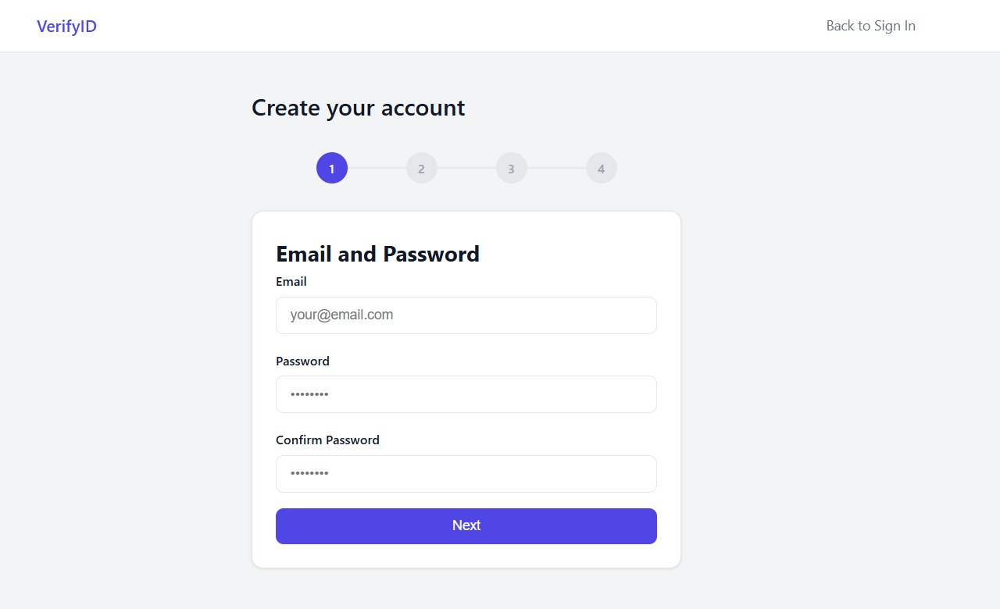
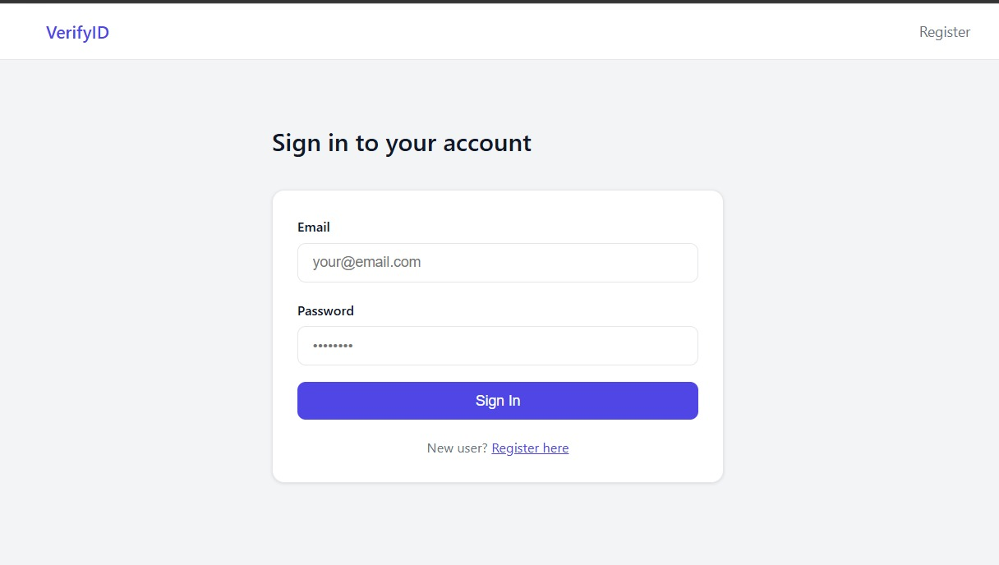
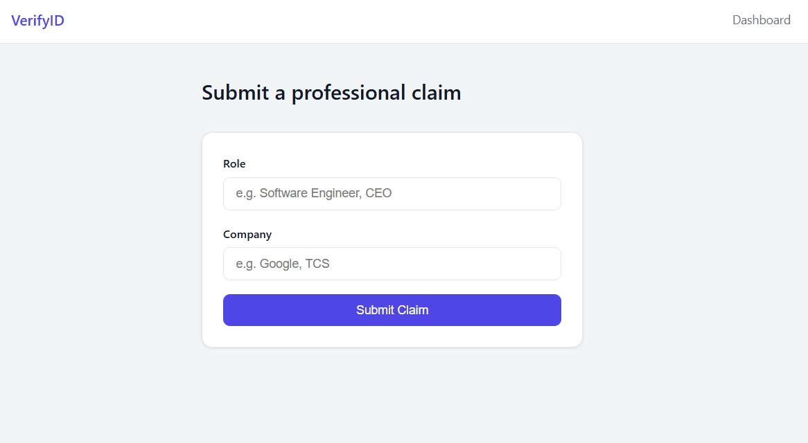
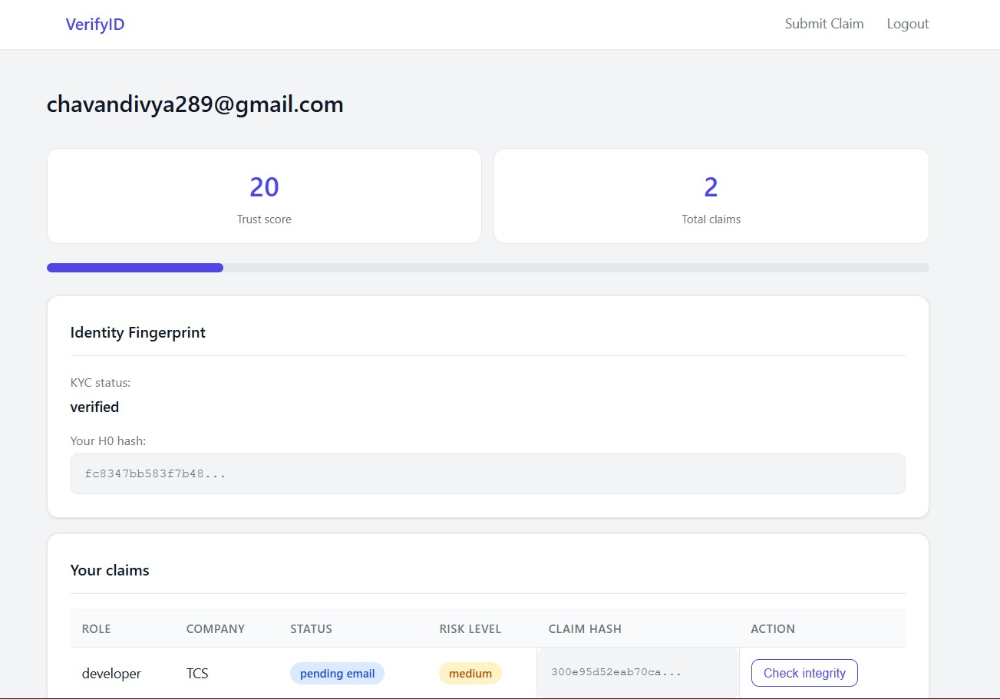

# VerifyID - Identity Verification System 🎯

## 🌟 What is VerifyID?

**VerifyID** is a risk-based identity and professional claim verification system designed to answer two critical questions:

> *"Are you who you say you are — and is your claimed role legitimate and untampered?"*

In today's digital world, fake profiles and credential fraud are rampant. VerifyID uses **facial recognition, cryptographic integrity, liveness detection, and behavioral trust scoring** to verify that professionals are who they claim to be. We connect verified professionals with legitimate job opportunities, building a trustworthy network where both professionals and companies can operate with confidence.

### The Problem We Solve
- 🚨 Fake profiles and impersonation on professional platforms
- 😤 Companies can't verify if they're hiring real people with genuine roles
- 🔗 Professionals worry about connecting with fraudsters
- 🔓 No way to detect if someone tampered with their claimed credentials
- ⚠️ Authority roles (CEO, Director, CTO) are frequently faked

### Our Solution
✅ **Identity Fingerprinting (H0 Root Hash)** - Cryptographic anchor at registration with face + device + email  
✅ **Live Face Verification** - MediaPipe liveness detection prevents photo spoofing  
✅ **Claim Hash Chains** - Blockchain-style integrity — detects if credentials were tampered with  
✅ **Risk-Based Tiers** - Dynamic verification based on role authority level  
✅ **Dynamic Trust Score** - 0-100 score reflecting KYC, verification, and behavior  
✅ **One Identity, One Account** - Cosine similarity prevents duplicate accounts  

---

## 📸 Platform Overview

### Step 1: Secure Registration
Users create an account and provide their professional details.



### Step 2: User Login
Secure authentication to access the platform.



### Step 3: Professional Verification
Submit your professional claim with your role and company.



### Step 4: Verified Dashboard
Access your professional dashboard with trust score, verification status, and claim integrity checks.



---

## 🏗️ Core Technical Features

### 1. Identity Fingerprinting — H0 Root Hash
At registration, a permanent **cryptographic anchor** is derived from three independent signals:
- **Face embedding** (128-dim vector via DeepFace Facenet)
- **Device fingerprint** (screen, OS, browser, hardware concurrency)
- **Email token** (OTP confirmed)

```
H0 = SHA-256(face_embedding + device_fingerprint + email_token)
```

H0 never changes and cannot be reconstructed without all three factors simultaneously — like a watermark baked into the identity at creation time.

---

### 2. Liveness Detection — No Photo Spoofing
Uses **MediaPipe FaceMesh** to track 468 facial landmarks across 3 frames captured 1 second apart. Movement of the nose tip landmark confirms a live person is present.

A printed photo or screen replay produces zero landmark movement and is automatically rejected.

---

### 3. Claim Hash Chain — Blockchain-Style Integrity
Every professional claim is cryptographically sealed:

```
C1 = SHA-256(H0 + role + company + timestamp)
C2 = SHA-256(C1 + new_role + new_company + timestamp)
```

Each claim links to the previous hash — exactly like blockchain blocks. If anyone edits a claim record directly in the database, the recomputed hash will not match the stored hash.

**Result:** Tamper detected → Badge revoked → Trust score frozen → Action logged.

---

### 4. Risk-Based Verification Tiers

| Risk Level | Triggered By | Required Action |
|---|---|---|
| **Low** | Generic roles (Developer, Designer, Manager) | Auto-approved if trust score ≥ 60 |
| **Medium** | Professional role with company (Senior Engineer at TCS) | Company email OTP verification |
| **High** | Authority roles (CEO, Founder, Director, CTO, CFO) | Document upload + manual admin review |

---

### 5. Dynamic Trust Score (0–100)

```
KYC verified           → +30 points
Email verified         → +15 points
Company email OTP      → +20 points
Document uploaded      → +15 points
Account age > 30 days  → +10 points
No duplicate face      → +10 points
─────────────────────────────────────
Maximum score          → 100 points
```

Score decreases on tamper detection (-30) or flagged activity.

---

### 6. Duplicate Face Detection
On registration, the new face embedding is compared against all stored embeddings using **cosine similarity**. A match above 0.80 blocks the registration.

**One face = one identity. Always.**

---

### 7. Document Integrity Check
Uploaded documents are SHA-256 hashed on arrival. If the same file hash already exists, the upload is rejected. Prevents reuse of a single document across multiple claims.

---

### 8. Behavioral Fingerprinting
Typing speed and mouse movement patterns are captured during registration and hashed into H0. An attacker using stolen credentials will behave differently than the real user.

---

### 9. Admin Review Dashboard
High-risk claims and OTP-verified medium-risk claims enter a manual review queue. Admins can:
- View claim details, documents, risk level, trust score
- Run per-claim integrity checks
- Approve or reject with a logged reason

---

### 10. Full Audit Log
Every action is permanently logged with user ID and timestamp:

```
registered | login | claim_submitted | otp_verified
document_uploaded | tamper_detected | claim_approved
claim_rejected | badge_issued
```

---

### 11. Escrow & Payout System
A secure payment gateway that handles event-based transactions:
- **Attendee Registration** - Users register and capture payments
- **Escrow Management** - Funds held securely until event completion
- **Check-in Tracking** - Monitor attendance rates
- **Ratings & Complaints** - Attendees submit feedback post-event
- **Admin Processing** - Admins review and approve payouts based on ratings and complaints
- **Refund Management** - Cancel events and issue full refunds automatically

This microservice ensures trust between event organizers and attendees by holding payments in escrow until all conditions are met.

---

## 💻 Technology Stack

| Layer | Technology | Purpose |
|---|---|---|
| **Frontend** | Html, CSS, Vanila JS | Interactive web application |
| **Backend** | Python Flask | REST API, business logic |
| **Database** | SQLite | Users, claims, documents, audit log |
| **Face AI** | DeepFace (Facenet) | 128-dimensional face embeddings |
| **Liveness Detection** | MediaPipe FaceMesh | 468-landmark live face detection |
| **Cryptography** | Python hashlib SHA-256 | Identity, claim, and file hashing |
| **Security** | Werkzeug | Password hashing (PBKDF2-SHA256) |
| **Payment Gateway** | Flask, JavaScript | Escrow and payout processing |

---

## 📁 Project Structure

```
DYP-Hirex-26-Web_verifiy/
│
├── frontend/                          # React web application
│   ├── src/
│   │   ├── pages/
│   │   │   ├── Register.jsx           # Multi-step registration with webcam
│   │   │   ├── Login.jsx              # Authentication
│   │   │   ├── FaceVerify.jsx         # Live face verification
│   │   │   ├── Jobs.jsx               # Job listings
│   │   │   └── Feed.jsx               # Professional network feed
│   │   ├── components/
│   │   │   └── Layout.jsx             # Authenticated user layout
│   │   ├── App.jsx                    # Home page & routing
│   │   └── main.jsx                   # Router configuration
│   ├── package.json                   # React dependencies
│   └── vite.config.js                 # Vite build configuration
│
├── backend-main/                      # Node.js/Python backend
│   ├── server.js                      # Flask + Node.js REST API
│   ├── database.sqlite                # SQLite database
│   ├── hash_engine.py                 # SHA-256 hashing for H0 & claims
│   ├── face_engine.py                 # DeepFace embedding + liveness
│   ├── risk_engine.py                 # Risk calculation & trust scoring
│   └── package.json                   # Backend dependencies
│
├── secureio/                          # Face verification microservice
│   ├── app.py                         # Flask face detection API
│   ├── requirements.txt               # Python dependencies
│   └── uploads/                       # Document uploads
│
├── paymentgateway2/                   # Escrow & Payout System
│   ├── app.py                         # Flask payment gateway application
│   ├── requirements.txt               # Python dependencies
│   ├── templates/                     # HTML templates
│   └── static/                        # CSS & JavaScript
│
├── images/                            # Screenshots & assets
│   ├── 1-register.png                 # Registration screenshot
│   ├── 2-login.png                    # Login screenshot
│   ├── 3-submit-claim.png             # Claim submission screenshot
│   └── 4-dashboard.png                # Dashboard screenshot
│
└── README.md                          # This file
```

---

## 🚀 Key Features Explained

### ✨ Multi-Step Secure Registration
1. Create account with email and password
2. Capture live face with MediaPipe liveness check
3. Device fingerprint automatically collected
4. H0 root hash generated and stored
5. Email OTP verification
6. Account ready for professional claims

### 🔐 Professional Claim Workflow
1. **Low-Risk Role** (e.g., "Developer")
   - Auto-approved if trust score ≥ 60
   - Badge issued immediately

2. **Medium-Risk Role** (e.g., "Senior Engineer at Company")
   - Company email OTP sent
   - After OTP verification: approved
   - Trust score increased to 70+

3. **High-Risk Role** (e.g., "CEO of Fortune 500")
   - Document upload required
   - Sent to admin review queue
   - Manual verification + background check
   - Approved only after admin confirms

### 💼 Claim Integrity Protection
- Each claim generates a hash: `C1 = SHA-256(H0 + role + company + timestamp)`
- Modifications detected automatically
- Tampering logged immediately
- Badge revoked on detection

### 📊 Trust Score System
- Starts at 0
- Increases with each verification step
- Max score: 100
- Decreases on suspicious activity
- Score visible to companies viewing profiles

---

## 🛠️ Setup Instructions (For Developers)

### Prerequisites
- **Node.js** (for frontend and backend)
- **Python 3.8+** (for face verification and payment gateway)
- **Git**

### Step 1: Clone the Project
```bash
git clone https://github.com/yojitg19/DYP-Hirex-26-Web_verifiy.git
cd DYP-Hirex-26-Web_verifiy
```

### Step 2: Set Up the Backend
```bash
cd backend-main
npm install
python -m pip install flask flask-cors werkzeug numpy opencv-python tensorflow deepface mediapipe
node server.js
# Server runs at http://localhost:3000
```

### Step 3: Set Up the Face Verification Service
```bash
cd secureio
pip install -r requirements.txt
python app.py
# Service runs at http://localhost:5000
```

### Step 4: Set Up the Payment Gateway
```bash
cd paymentgateway2
python -m venv venv
venv\Scripts\Activate.ps1
pip install -r requirements.txt
python app.py
# Service runs at http://localhost:5000 (or use a different port if 5000 is in use)
```

### Step 5: Set Up the Frontend
```bash
cd frontend
npm install
npm run dev
# Visit http://localhost:5173
```

---

## 📡 API Reference

| Method | Endpoint | Description |
|---|---|---|
| POST | `/api/register` | Register with face + email + device |
| POST | `/api/login` | Login and receive trust score |
| POST | `/api/claim/submit` | Submit a professional claim |
| POST | `/api/claim/verify-otp` | Verify company email OTP |
| POST | `/api/claim/upload-document` | Upload verification document |
| GET | `/api/claim/integrity-check/<id>` | Check claim for tampering |
| GET | `/api/admin/pending-claims` | Get all manual review queue items |
| POST | `/api/admin/review-claim` | Approve or reject a claim |
| GET | `/api/user/dashboard/<id>` | Get user data and all claims |

### Payment Gateway Endpoints

| Method | Endpoint | Description |
|---|---|---|
| POST | `/register-attendee` | Register attendee and capture payment |
| POST | `/check-in` | Check-in attendee for event |
| POST | `/submit-rating` | Submit event rating and complaints |
| GET | `/admin-dashboard` | View payout processing queue |
| POST | `/process-payout` | Approve/reject payout decision |
| POST | `/refund-event` | Cancel event and refund all attendees |

All responses follow a consistent shape:
```json
{ "success": true, "data": {} }
{ "success": false, "error": "message" }
```

---

## 🎮 Demo Scenarios

**Scenario 1 — Normal Developer**
- Registers → face verified → H0 created → trust score 50
- Submits "Developer" claim → risk = LOW → auto-approved
- Badge issued instantly

**Scenario 2 — Fake CEO**
- Registers with Gmail → submits "CEO of XYZ Corp"
- Risk = HIGH → sent to manual review
- Admin sees no documents → claim rejected
- Badge not issued

**Scenario 3 — Real Professional**
- Registers → submits "Software Engineer at TCS"
- Risk = MEDIUM → company OTP sent
- OTP verified → document uploaded → trust score 95
- Admin approves → verified badge issued

**Scenario 4 — Database Tampering**
- Attacker edits claim: "Developer" → "CEO" in SQLite
- Integrity check runs → hash mismatch detected
- Claim flagged → trust score drops 30 points
- Action logged as `tamper_detected`
- Badge revoked automatically

**Scenario 5 — Event Payment & Escrow**
- 50 verified professionals register for an event
- Payment captured and held in escrow
- Event completes, 45 attendees check in (90% attendance)
- Attendees submit ratings (average 4.5/5 stars)
- Admin approves payout → organizer receives funds
- System automatically settles transaction

**Scenario 6 — Disputed Event & Refund**
- Event organizer fails to deliver promised content
- Attendees submit complaints during post-event survey
- Admin reviews: multiple complaints, 2-star ratings
- Admin rejects payout → funds automatically refunded to attendees
- Organizer loses credibility and platform trust


---

## 🔒 Security Implementation

- **Passwords** hashed using Werkzeug PBKDF2-SHA256
- **Face embeddings** stored as JSON, never raw images
- **OTPs** expire after 10 minutes
- **File uploads** secured with `secure_filename` to prevent path traversal
- **Device fingerprint** bound to H0 — different device raises a flag
- **Duplicate detection** threshold: cosine similarity 0.80
- **Rate limiting** on registration and OTP endpoints


---

## 🔮 Future Enhancements

- Real email sending for OTP delivery (SMTP / SendGrid)
- JWT tokens for stateless session management
- Blockchain anchoring (Polygon / Ethereum)
- ML-based anomaly detection on behavioral patterns
- Re-verification triggered by device fingerprint changes
- Advanced admin analytics dashboard

---

## 📝 Notes

- Built for the **DYP Hirex 2026** competition
- Enterprise-grade identity verification system
- Production-ready architecture with audit logging
- Compliant with best practices for identity verification

---

## 👥 Team: Codex

Meet the talented team behind VerifyID:

| Name | Role |
|------|------|
| Yojit Giri | Team Leader |
| Pratiksha Suryawanshi | Team Member |
| Rayan Rahman | Team Member |
| Divya Chavan | Team Member |
| Shreenidhi Gupta | Team Member |

**Team Codex** - Building trustworthy digital networks for professionals worldwide! 🚀

---

**Built with ❤️ for the DYP Hirex 2026 Competition**
